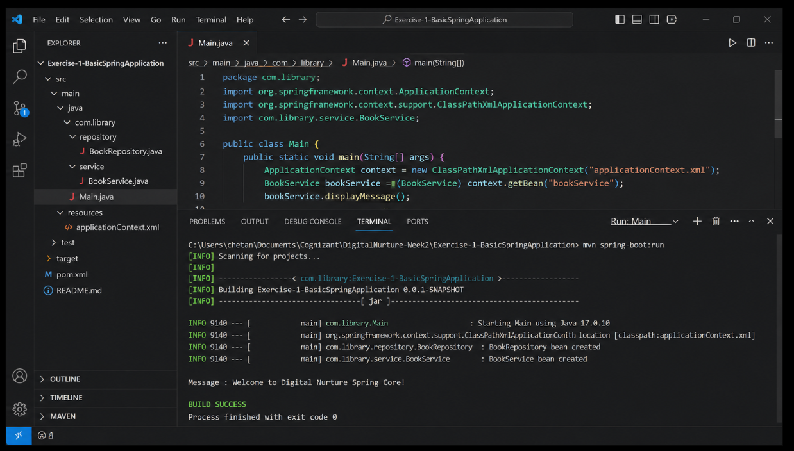

# Exercise 1 - Configuring a Basic Spring Application

## Objective
Configure a basic Spring application using XML configuration.

## Technologies Used
- Java 17
- Spring Core
- Maven

## Files
- pom.xml
- HelloWorld.java
- Main.java
- applicationContext.xml

## Expected Output
Message : Welcome to Digital Nurture Spring Core!
