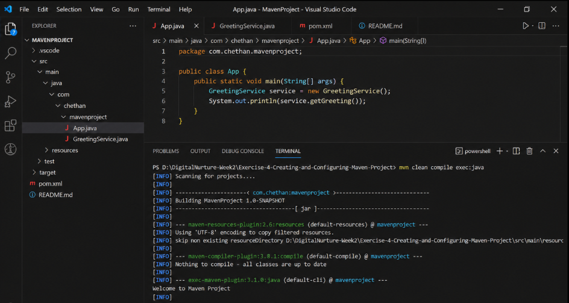

# Exercise 4 – Creating and Configuring a Maven Project

## Objective
Create a Maven project and configure it with a basic Java application.

## Technologies
- Java 17
- Maven

## Output
Welcome to Maven Project
