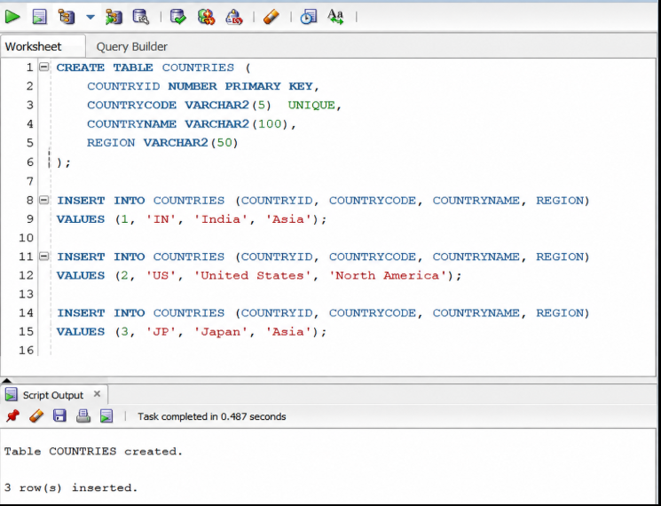

# Exercise 2 - Load Country from Spring Configuration XML

## Objective
Load a Country bean from an XML configuration file using the Spring IoC container.

## Technologies
- Java 17
- Spring Boot
- Spring Core
- Maven

## Output Screenshot
Country{code='IN', name='India'}
