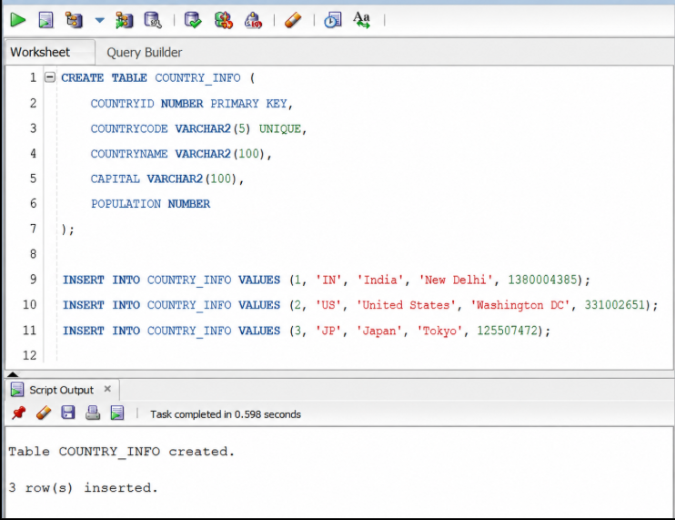

# Exercise 5 - Get Country by Country Code

## Endpoint
GET /countries/{code}

### Examples
GET /countries/IN
GET /countries/US
GET /countries/JP
GET /countries/DE

## Output Screenshot
{  "code":"IN",  "name":"India"}
