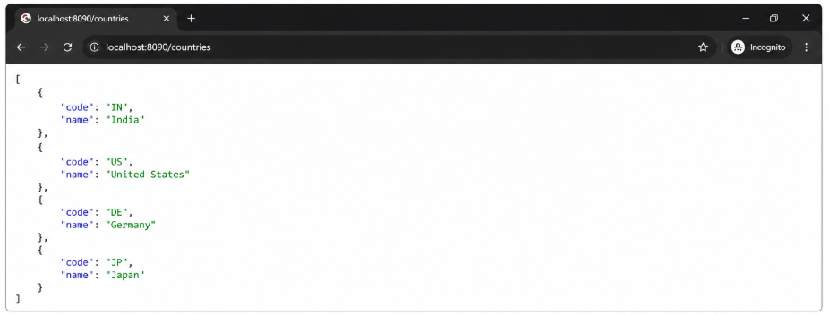

# Exercise 6 - JWT Authentication

Spring Boot 3 JWT starter for the Cognizant JWT hands-on.

## Endpoints

- `GET /authenticate` - Basic Auth login that returns a JWT
- `GET /countries` - Protected sample endpoint

## Run

Start `com.chethan.jwt.JwtApplication` on port `8090`.

## Output : Access Protected Countries API
