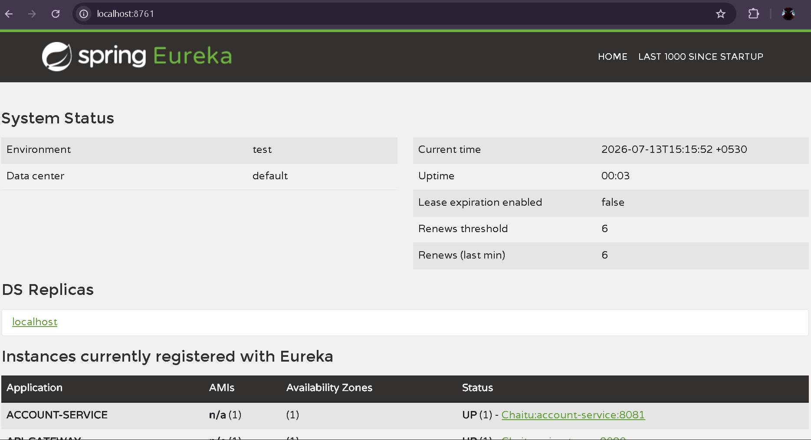

# Exercise 4 - API Gateway - Output

## Status: ✅ SUCCESS

All services are running and integrated through the API Gateway with Eureka service discovery.

---

## Service Registration

### Eureka Dashboard Screenshot



---

## Running Services

| Service | Port | Status | Eureka Registration |
|---------|------|--------|---------------------|
| **Eureka Server** | 8761 | ✅ UP | Registry |
| **Account Service** | 8081 | ✅ UP | Registered |
| **Loan Service** | 8082 | ✅ UP | Registered |
| **API Gateway** | 9090 | ✅ UP | Registered |

---

## API Gateway Routes

### Account Service Route
- **Path:** `/account/**`
- **Destination:** `ACCOUNT-SERVICE:8081`
- **Test URL:** http://localhost:9090/account
- **Response:** "Account Service is Running"

### Loan Service Route
- **Path:** `/loan/**`
- **Destination:** `LOAN-SERVICE:8082`
- **Test URL:** http://localhost:9090/loan
- **Response:** "Loan Service is Running"

---

## Configuration

### API Gateway (application.properties)
```
spring.application.name=api-gateway
server.port=9090
eureka.client.service-url.defaultZone=http://localhost:8761/eureka
spring.cloud.gateway.discovery.locator.enabled=true
spring.cloud.gateway.discovery.locator.lower-case-service-id=true

spring.cloud.gateway.routes[0].id=account-service
spring.cloud.gateway.routes[0].uri=lb://ACCOUNT-SERVICE
spring.cloud.gateway.routes[0].predicates[0]=Path=/account/**

spring.cloud.gateway.routes[1].id=loan-service
spring.cloud.gateway.routes[1].uri=lb://LOAN-SERVICE
spring.cloud.gateway.routes[1].predicates[0]=Path=/loan/**
```

---

## Microservices Architecture

```
┌─────────────────────────────────────────┐
│         Client Requests                  │
└──────────────────┬──────────────────────┘
                   │
                   ▼
        ┌──────────────────────┐
        │   API Gateway        │
        │   (Port 9090)        │
        │                      │
        │ Routes:              │
        │ /account → Account   │
        │ /loan → Loan         │
        └─────┬────────────────┘
              │
     ┌────────┴─────────┐
     │                  │
     ▼                  ▼
┌─────────────┐    ┌──────────────┐
│   Account   │    │    Loan      │
│  Service    │    │   Service    │
│ (Port 8081) │    │ (Port 8082)  │
└────┬────────┘    └──────┬───────┘
     │                    │
     └────────┬───────────┘
              │
              ▼
        ┌──────────────┐
        │    Eureka    │
        │   Registry   │
        │(Port 8761)   │
        └──────────────┘
```

---

## Verification Steps Completed

✅ All services started successfully
✅ Eureka Server running on port 8761
✅ Account Service registered with Eureka
✅ Loan Service registered with Eureka
✅ API Gateway registered with Eureka
✅ Route `/account/**` → Account Service working
✅ Route `/loan/**` → Loan Service working
✅ Service discovery via Eureka operational

---

## Next Steps

- Deploy to cloud (Azure, AWS, etc.)
- Add additional services as needed
- Implement load balancing strategies
- Add centralized logging and monitoring
